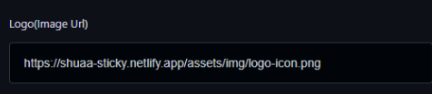
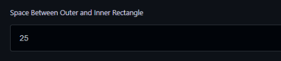
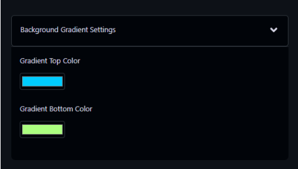
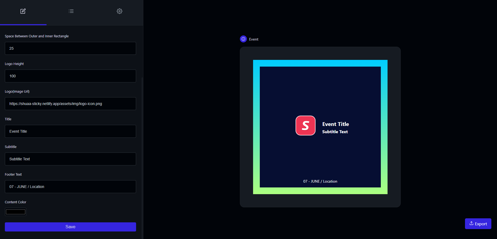

# Add A Template

## Template

The `TemplateInterface` represents the structure of a template. It has the following properties:

<ul><li><code><strong>id</strong></code> (string): The unique identifier of the template.</li><li><code><strong>version</strong></code> (string): The version number of the template.</li><li><code><strong>name</strong></code> (string): The name of the template.</li><li><code><strong>description</strong></code> (string): The description of the template.</li><li><code><strong>height</strong></code> (number): The height of the template.</li><li><code><strong>width</strong></code> (number): The width of the template.</li><li><code><strong>style</strong></code> (string, optional): Additional CSS styles for the template.</li><li><code><strong>render</strong></code> (string): The HTML markup for rendering the template.</li><li><code><strong>settings</strong></code> (array of <code><strong>TemplateSettingsInterface</strong></code>): An array of settings for the template.</li></ul>

## Template Setting

The `TemplateSettingsInterface` represents the structure of a template setting. It has the following properties:
<ul><li><code><strong>id</strong></code> (string): The unique identifier of the template.</li><li><code><strong>version</strong></code> (string): The version number of the template.</li><li><code><strong>name</strong></code> (string): The name of the template.</li><li><code><strong>description</strong></code> (string): The description of the template.</li><li><code><strong>height</strong></code> (number): The height of the template.</li><li><code><strong>width</strong></code> (number): The width of the template.</li><li><code><strong>style</strong></code> (string, optional): Additional CSS styles for the template.</li><li><code><strong>render</strong></code> (string): The HTML markup for rendering the template.</li><li><code><strong>settings</strong></code> (array of <code><strong>TemplateSettingsInterface</strong></code>): An array of settings for the template.</li></ul>

## Field Types

The Post Builder app supports the following field types:

<ul>
<li><code><strong>ColorType</strong></code>: Represents a color field.</li>
<li><code><strong>ImageType</strong></code>: Represents an image field.</li><li><code><strong>NumberType</strong></code>: Represents a number field.</li><li><code><strong>TextType</strong></code>: Represents a text field.</li><li><code><strong>GroupType</strong></code>: Represents a group of child types.</li></ul>

### ColorType
The `ColorType` represents a color field. It allows users to select a color for a specific setting.
#### JSON Snippet:

```json
{
  "id": "1",
  "key": "gradient_top_color",
  "type": { "handle": "FIELD/COLOR" },
  "version": "1.0",
  "name": "Gradient Top Color",
  "description": "Select a color for the top gradient",
  "value": "#00ccff"
}
```

#### Setting Output:


### ImageType
The `ImageType` represents an image field. It enables users to add an URL image to display it on the the post.
#### JSON Snippet:

```json
{
  "id": "4",
  "key": "logo_url",
  "type": { "handle": "FIELD/URL" },
  "version": "1.0",
  "name": "Logo (Image URL)",
  "description": "Upload a logo image",
  "value": "https://example.com/logo.png"
}
```

#### Setting Output:


### TextType
The `TextType` represents a text field. Users can enter a text value for a specific setting.
#### JSON Snippet:

```json
{
  "id": "5",
  "key": "title",
  "type": { "handle": "FIELD/TEXT" },
  "version": "1.0",
  "name": "Title",
  "description": "Enter the title",
  "value": "Event Title"
}
```

#### Setting Output:


### NumberType
The `NumberType` represents a number field. Users can enter a numerical value for a specific setting.
#### JSON Snippet:

```json
{
  "id": "3",
  "key": "space_between_outer_inner",
  "type": { "handle": "FIELD/NUMBER" },
  "version": "1.0",
  "name": "Space Between Outer and Inner Rectangle",
  "description": "Enter the space in pixels",
  "value": 25
}
```

#### Setting Output:


### GroupType
The `GroupType`  represents a group of child types. It allows users to group multiple settings together.
#### JSON Snippet:

```json
{
  "id": "1",
  "key": "bg-gradient-settings",
  "type": { "handle": "GROUP/ACCORDION" },
  "version": "1.0",
  "name": "Background Gradient Settings",
  "description": "Background Gradient Settings",
  "value": "",
  "childSettings": [
    // Child settings go here...
  ]
}
```

#### Setting Output:


## Full Example
### Json
```json
    {
  "id": 222,
  "name": "Event",
  "version": "1.0",
  "description": "This is an Event template.",
  "height": 500,
  "width": 500,
  "style": ".event_template__content-right * {margin: 0;} .event_template__content-right *:not(:last-child) {margin-bottom: 5px;} .event_template__outer { height: 100%; background-image: linear-gradient(%gradient_top_color%, %gradient_bottom_color%); padding: %space_between_outer_inner%px; } .event_template__inner { color: %content_color%; position: relative; height: 100%; width: 100%; background-color: %inner_rectangle_color%; display: flex; flex-direction: column; justify-content: center; align-items: center;} .event_template__logo {height: %logo_height%px;} .event_template__content { display: flex; gap: 10px; align-items:center; justify-content: center; } .event_template__title { font-size: 20px; font-weight: bold; } .event_template__subtitle { font-size: 16px; font-weight: bold; } .event_template__footer { font-size: 14px; position: absolute; bottom: 14px; }",
  "render": "<div class='event_template__outer'><div class='event_template__inner'><div class='event_template__content'><div class=event_template__content-left></div><div class=event_template__content-right><h2 class='event_template__title'>%title%</h2><p class='event_template__subtitle'>%subtitle%</p></div></div><div class=event_template__footer>%footer_text%</div></div></div>",
  "settings": [
    {
      "id": "1",
      "key": "bg-gradient-settings",
      "type": {
        "handle": "GROUP/ACCORDION"
      },
      "version": "1.0",
      "name": "Background Gradient Settings",
      "description": "Background Gradient Settings",
      "value": "",
      "childSettings": [
        {
          "id": "1",
          "key": "gradient_top_color",
          "type": {
            "handle": "FIELD/COLOR"
          },
          "version": "1.0",
          "name": "Gradient Top Color",
          "description": "Select a color for the top gradient",
          "value": "#00ccff"
        },
        {
          "id": "2",
          "key": "gradient_bottom_color",
          "type": {
            "handle": "FIELD/COLOR"
          },
          "version": "1.0",
          "name": "Gradient Bottom Color",
          "description": "Select a color for the bottom gradient",
          "value": "#acff80"
        }
      ]
    },
    {
      "id": "2",
      "key": "inner_rectangle_color",
      "type": {
        "handle": "FIELD/COLOR"
      },
      "version": "1.0",
      "name": "Inner Rectangle Color",
      "description": "Select a color for the inner rectangle",
      "value": "#060E32"
    },
    {
      "id": "3",
      "key": "space_between_outer_inner",
      "type": {
        "handle": "FIELD/NUMBER"
      },
      "version": "1.0",
      "name": "Space Between Outer and Inner Rectangle",
      "description": "Enter the space in pixels",
      "value": 25
    },
    {
      "id": "9",
      "key": "logo_height",
      "type": {
        "handle": "FIELD/NUMBER"
      },
      "version": "1.0",
      "name": "Logo Height",
      "description": "Enter the height in pixels",
      "value": 100
    },
    {
      "id": "4",
      "key": "logo_url",
      "type": {
        "handle": "FIELD/URL"
      },
      "version": "1.0",
      "name": "Logo(Image Url)",
      "description": "Upload a logo image",
      "value": "https://shuaa-sticky.netlify.app/assets/img/logo-icon.png"
    },
    {
      "id": "5",
      "key": "title",
      "type": {
        "handle": "FIELD/TEXT"
      },
      "version": "1.0",
      "name": "Title",
      "description": "Enter the title",
      "value": "Event Title"
    },
    {
      "id": "6",
      "key": "subtitle",
      "type": {
        "handle": "FIELD/TEXT"
      },
      "version": "1.0",
      "name": "Subtitle",
      "description": "Enter the subtitle text",
      "value": "Subtitle Text"
    },
    {
      "id": "7",
      "key": "footer_text",
      "type": {
        "handle": "FIELD/TEXT"
      },
      "version": "1.0",
      "name": "Footer Text",
      "description": "Enter the footer text",
      "value": "07 - JUNE / Location"
    },
    {
      "id": "8",
      "key": "content_color",
      "type": {
        "handle": "FIELD/COLOR"
      },
      "version": "1.0",
      "name": "Content Color",
      "description": "Select a color for content texts",
      "value": "white"
    }
  ]
}
```
### Settings and template render


## Customizing the Template

To customize the appearance of the template, you need to create the `style` and `render` properties in your application and include the appropriate placeholders. The app will automatically replace the placeholders with the actual values defined in the template's `settings` array.

### Style Customization

The `style` property contains CSS styles that define the visual presentation of the template. To customize the styles, follow these steps:

1. Create the `style` property: Include the desired CSS styles for your template.

2. Use placeholders from `settings`: Identify the keys of each setting in the template's `settings` array. These keys will serve as placeholders in the `style` property.

### Render Customization

The `render` property contains the HTML markup that defines the structure and content of the template. To customize the render, follow these steps:

1. Create the `render` property: Include the desired HTML markup for your template.

2. Use placeholders from `settings`: Identify the keys of each setting in the template's `settings` array. These keys will serve as placeholders in the `render` property.

### Example

Here's an example of how the `style` and `render` properties may look:

```json
"style": ".custom-template__content { color: %content_color%; }",
"render": "<div class='custom-template__outer'><div class='custom-template__inner'><p class='custom-template__content'>%custom_text%</p></div></div>",
